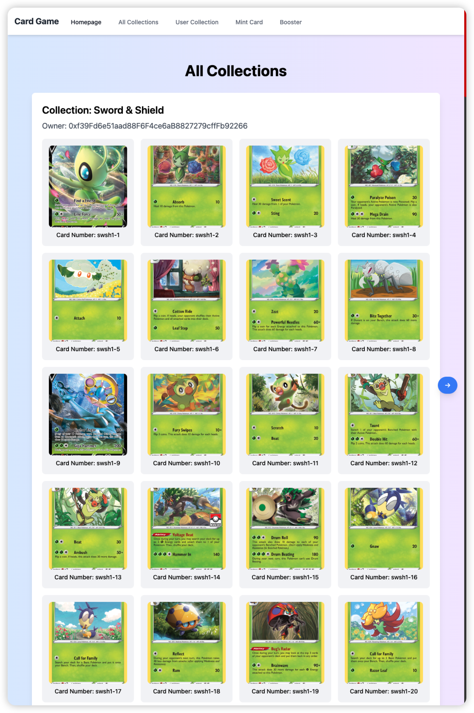

# Collectible Card Game

Welcome to the DAAR project. The idea will be to implement a Collectible Card Game
in a decentralized way, on Ethereum. This will force you to iterate through the creation
of CCG cards as NFT, create a marketplace for players to exchange NFT, and run a frontend to create collections.

[First slideshow](https://www.figma.com/file/MbBKLKATrPIRNDPfY23uwW/Blockchain-%26-Smart-Contracts?type=design&node-id=0%3A1&mode=design&t=FvBuqccvh9fpfW1o-1) [Second slideshow](https://www.figma.com/file/MbBKLKATrPIRNDPfY23uwW/Blockchain-%26-Smart-Contracts?type=design&node-id=184%3A368&mode=design&t=krkx1v8TmtDCpSTl-1)

# Lancement du projet
1. lancer frontend d'abord
```bash
cd frontend
yarn run dev
```
port:  http://localhost:5173/

2. lancer puis hardhat
```bash
cd contracts
npx hardhat node
```
port:  http://localhost:8545/

3. lancer backend finalement
```bash
cd backend
node server.js
```
port:  http://localhost:6854

# Rapport
[Google Doc](https://docs.google.com/document/d/1g85dx6x2d4EX-Uw8z9HaH0IIonGH_yij5JcdHHp9PVw/edit?usp=sharing)


# Demo Video
[Google Drive - Video](https://drive.google.com/file/d/1C_re9Dv5pRINBOsXCsK5fGducNXS5qSO/view?usp=sharing)

# Welcome!



# Subject

TCG, or Trading Card Game, sometimes called CCG, for Collectible Card Game, are a type of game in which you're opening randomized packs of cards, called boosters, and you're building your pack of cards, called decks, to play against other players. This is a popular format nowadays, both physically or digitally. The most famous of them are [Magic, The Gathering](https://en.wikipedia.org/wiki/Magic:_The_Gathering_Arena), [Pokémon TCG](https://en.wikipedia.org/wiki/Pok%C3%A9mon_Trading_Card_Game), [Yu-Gi-Oh!](https://en.wikipedia.org/wiki/Yu-Gi-Oh!_Trading_Card_Game), [Hearthstone](https://en.wikipedia.org/wiki/Hearthstone), [Marvel Snap](https://en.wikipedia.org/wiki/Marvel_Snap), or even [Legends of Runeterra](https://en.wikipedia.org/wiki/Legends_of_Runeterra). You probably heard about at least one, maybe played with some of them.
The subject of this project will be to put yourself at the place of a TCG creator, and to create a TCG on the Ethereum and other EVM-compatible blockchains. To fulfill this goal, you'll need to understand the different parts of the game, from the onchain part (hosted on the blockchain) to the offchain parts (the frontend and the backend) of the game. While you could go to the end and build a complete, working TCG, you'll not be asked to build a game engine. This would take more than a bunch of weeks, and it's not the scope of the project. The project will be focused on building the _collectible_ part of the project. In other words, you'll build the way to collect digital cards, make them possible to exchange with some friends, browse the cards on your web browser, and order your collection as you want.
In a real TCG, a new set of cards is published approximately every 3 to 4 months. You work will be to build a complete infrastructure able to manage a new collection of cards on a regular basis.

More specifications: the cards will be represented as NFT, or Non-Fungible Tokens. It's the best way to represent collectibles on a blockchain. For this, you'll implement the ERC-721 norm, and you'll build the different frontends and backends on your own. The project is here to help you kickstart the infrastructure.

